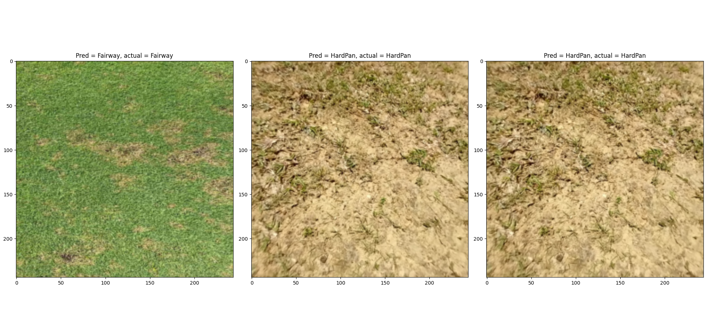

# Project Progress Log

## Week 1 — Project Setup & Research
**Goals**
- Define app scope
- Choose ML approach
- Set up Xcode project

**Hurdles**
-Running build on physical phone to test camera integration 

**Completed**
- Created GitHub repository

**Notes**
- Decided to start with single-image capture before real-time detection

---

## Week 2 — Vision & Core ML Integration
**Goals**
- Run object detection on static images
- Display bounding boxes
- Integrate Vision framework

**Hurdless**
Tool detection required large scales of "messy" data, and would have benifitted from a self-created dataset. Gathering such a dataset, or using mixing available ones online would have greatly slowed development. 
This greatly factored in the pivot to the Golf tool : Lie-Caddy. 

**Completed**
- Vision framework

## Week 3 - Curating Dataset
- Dataset is being manually collected
  
**Hurdles** 
Will take 4+ weeks to generate sufficient dataset am seeking alternatives. 

## Week 4 - Start Pipeline/Workflow on smaller online grass dataset. 
**Goals** 
- Implement pipleine i.e model/data loading, training loop, eval.
- Research MobileNetV3 and alternatives. 
- Re-familiarise with Torch.
- Evaluate model's effectiveness on a small dataset with limited classes. 

**Completed**
- Smaller "practice" dataset aquired (3 classes) : 
- https://universe.roboflow.com/iowa-state-university-krhld/grass-o0vum
- Using fairway class for fairway. 
- https://universe.roboflow.com/idp-yg67x/grass-biabe
- Using healthy class as "light rough" and overgrazed class as "hard pan"

## Week 5 - Finish Pipline - Train model on smalller dataset. 

**Goals** 
- Finalise pipeline, 
- Choose hyperparemters
- Fix bugs in dataset implementation
- Evaluate model performance:

**Completed**
- Pipeline finalised E.g Train Loop, Eval loop
- Custom Datset logic implmemented

- basic model training successful!
- avg high accuracy > 94% over 72 imgs in validation set. 

** Hurdles**
- Fixing thread race bug, causing crash on app open. 
- Required asynchronous startup of cameramanger and camerapreview to be handled in a sequential queue. 

**Notes**
- Cross Entropy loss chosen as default loss function due to its suitablilty accross many COMP Vision and classification 
 ML tasks
 - Hyperparamter tuning to be attempted later. 

## Week 6
**Goals**
- Export model into swiftcode enuring proper prediction  on image capture. 
- Train model on real dataset
- Potentially use synthetic data generation to augment current dataset.

**Achieved**
- Exported model using CoreMLTools into xcode.
- Used Vision module (VNCoreMLModeL) to genearate real time predictions from model.
- Updated camera view to show label to image appropriately.

**Hurdles**
- Model needed to be modified (baking normalisation into model)
- Required a wrapper (ModelWithNorm) class, which was then exported via coreML tools.

## Week 7/8:
**Goals**
- Code "advice engine", using model predictions.
- Update UI to reflect.
- Import assests / app theme
- Further increase dataset
- Begin training on actual dataset, noting class changes/performance.

**Notes**
For advice engine, pivot to a tree-based ML algorithm could be useful and potentially generate more accurate predictions/advice, however large amount of would need to be generated (combinations), so for now simple logic statements are more appropriate. 